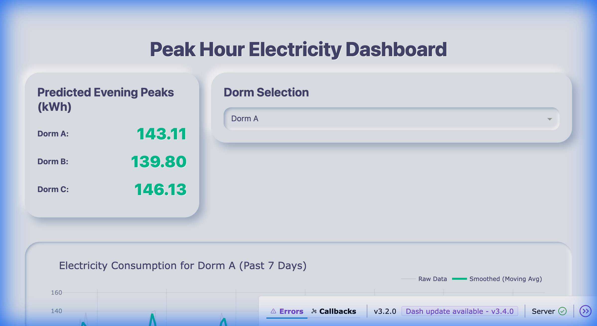
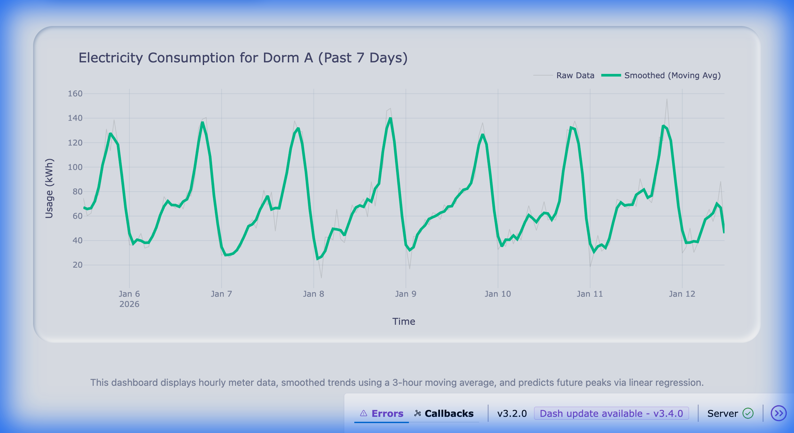

# Peak Hour Electricity Spikes Prediction & Dashboard

This project provides an end-to-end solution for collecting, processing, and visualizing electricity consumption data from university dormitories. It uses moving average smoothing for noise reduction and linear regression to predict future evening peaks.

## 🚀 Features
- **Data Simulation**: Generate realistic hourly meter data for multiple dorms.
- **Smart Smoothing**: Uses a 3-hour centered moving average to clarify trends.
- **Predictive Analytics**: Forecasts the next day's evening peak using linear regression on historical peaks.
- **Interactive Dashboard**: A high-performance Dash/Plotly dashboard with a premium dark theme.

## 🛠️ Project Structure
- `data_generator.py`: Generates synthetic electricity usage data.
- `processor.py`: Contains logic for data smoothing and linear regression.
- `app.py`: The Dash application for visualization.
- `electricity_data.csv`: (Generated) Storage for the raw and processed data.

## 📦 Installation

1. **Clone the repository** (or navigate to the project folder):
   ```bash
   cd peak-hour-electricity
   ```

2. **Set up a virtual environment**:
   ```bash
   python3 -m venv venv
   source venv/bin/activate
   ```

3. **Install dependencies**:
   ```bash
   pip install -r requirements.txt
   ```

## 🖥️ Usage

1. **Run the Dashboard**:
   ```bash
   python app.py
   ```
   *Note: If `electricity_data.csv` does not exist, the app will automatically run `data_generator.py` first.*

2. **Access the Dashboard**:
   Open your browser and go to [http://127.0.0.1:8050/](http://127.0.0.1:8050/).

## 📊 Dashboard Preview



The dashboard displays:
- **Predicted Evening Peaks**: Real-time forecast for each dorm.
- **Consumption Trends**: Interactive graph showing raw vs. smoothed data for the past 7 days.
- **Dorm Selection**: Dropdown to switch between different monitored locations.

## 🧪 Tech Stack
- **Dashboard**: Dash, Plotly, Dash Bootstrap Components
- **Data Analysis**: Pandas, NumPy, Scikit-Learn
- **Styling**: Bootstrap (Darkly theme)
