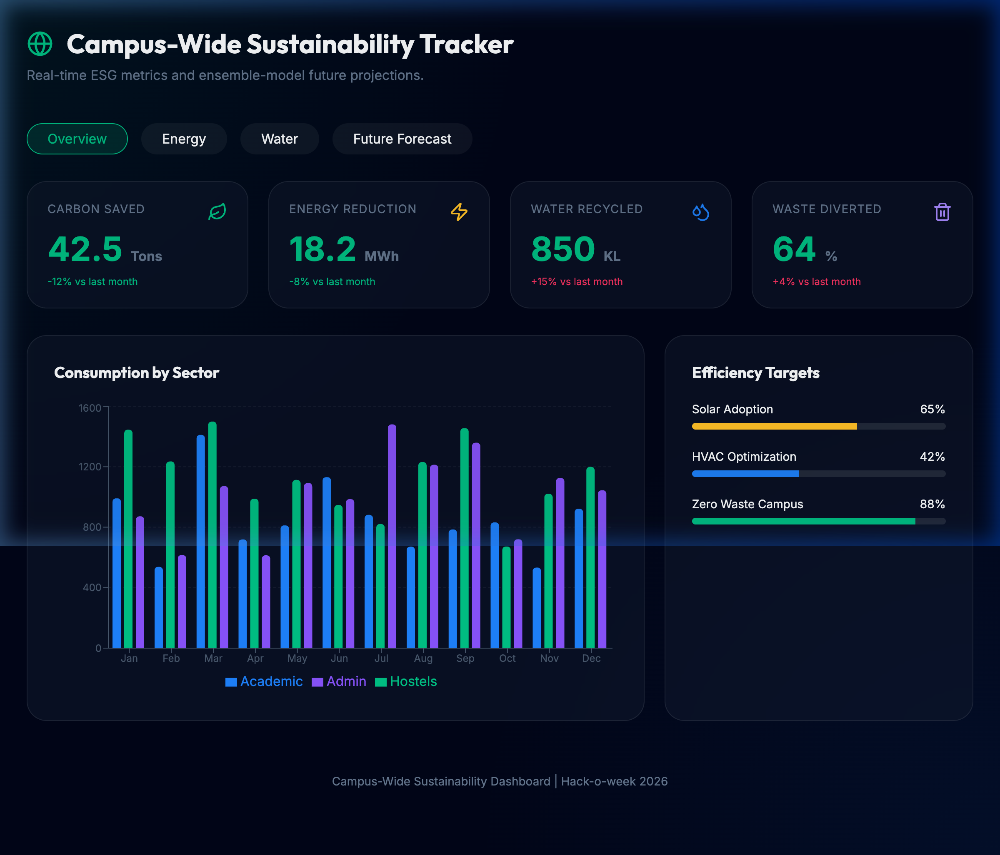

# Week 10: Campus-Wide Sustainability Tracker

A comprehensive ESG (Environmental, Social, and Governance) dashboard for campus monitoring, featuring **Ensemble Modeling** for future carbon footprint forecasting.

## Project Overview
This repository provides a centralized view of sustainability KPIs across multiple campus sectors (Academic, Hostels, Admin, Sports). It integrates multiple data sources to track Energy, Water, and Waste metrics.

### Key Features
- **Ensemble Forecasting**: Combines Linear Regression with Weight-based Smoothing to predict quarterly carbon output with confidence intervals.
- **Interactive KPIs**: Animated cards tracking Carbon Saved, Energy Reduction, and Water Recycling.
- **Sector Drill-Down**: Visualizes consumption patterns across different campus buildings.
- **High-Performance UI**: Uses Framer Motion for smooth transitions and a modern "high-tech" look.

## Dashboard Preview

## Tech Stack
- React
- Vite
- Framer Motion
- Recharts
- Regression.js
- Lucide React

## Getting Started
1. `npm install`
2. `npm run dev`
