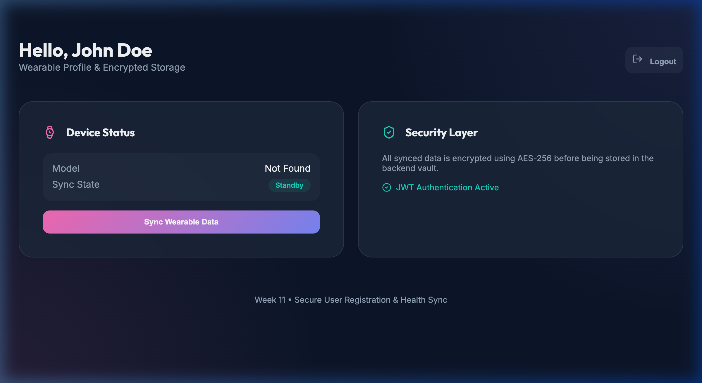

# Week 11: User Registration Portal

A secure user registration and health data synchronization portal featuring **JWT Authentication** and **AES-256 Encryption**.

## Project Overview
This project provides a full-stack solution for managing user accounts and sensitive wearable data. It demonstrates secure authentication flows and encrypted data storage for health-related profiles.

### Key Features
- **JWT Authentication**: Secure login and signup with JSON Web Tokens and bcrypt password hashing.
- **Data Encryption**: All wearable data (Health Sync) is encrypted using `crypto-js` (AES-256) before being sent to the backend.
- **Wearable Sync Dashboard**: A premium React interface that simulates device synchronization and profile decryption.
- **Secure Backend**: Node.js/Express API with protected routes and server-side encryption key management.

## Dashboard Preview


## Tech Stack
- **Frontend**: React, Vite, Framer Motion, Lucide React.
- **Backend**: Node.js, Express, JWT, BcryptJS, Crypto-JS.

## Getting Started
### 1. Server Setup
```bash
cd server
npm install
node server.js
```

### 2. Client Setup
```bash
cd client
npm install
npm run dev
```
