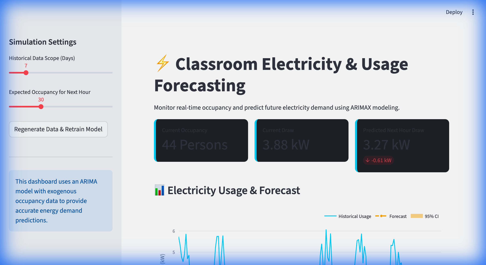

# ⚡ Classroom Electricity Usage Forecasting



A smart energy forecasting system that uses **Wi-Fi occupancy logs** to predict classroom electricity consumption. Built with an **ARIMAX model**, this project provides real-time insights and next-hour demand predictions with 95% confidence intervals.

## 🌟 Key Features

- **ARIMAX Forecasting**: Leverages historical electricity data with occupancy as an exogenous variable for superior accuracy.
- **Dynamic Dashboard**: Interactive Streamlit interface with rich visualizations.
- **Confidence Intervals**: Statistical bounds (95% CI) for every forecast to support reliable decision-making.
- **Synthetic Data Engine**: Realistic simulation of classroom behavior, occupancy peaks, and energy usage patterns.

## 🛠️ Tech Stack

- **Forecasting**: `statsmodels` (ARIMA), `pmdarima`
- **Dashboard**: `Streamlit`
- **Data Analysis**: `pandas`, `numpy`
- **Visualizations**: `Plotly`

## 🚀 Getting Started

### 1. Clone the Repository
```bash
git clone https://github.com/DevDhapodkar/Classroom-Usage-Forecasting-Walkthrough.git
cd Classroom-Usage-Forecasting-Walkthrough
```

### 2. Install Dependencies
```bash
pip install -r requirements.txt
```

### 3. Run the Dashboard
```bash
streamlit run app.py
```

## 📊 How it Works

1. **Data Generation**: `data_generator.py` simulates hourly occupancy (Wi-Fi connected devices) and baseline energy draw.
2. **Modeling**: `model.py` trains an ARIMAX model. Unlike standard ARIMA, it uses the "Next Hour Occupancy" as a hint to predict energy spikes.
3. **Visualization**: The dashboard displays historical trends, predicted spikes, and the uncertainty range for the next hour.

## 📂 Project Structure

- `app.py`: Main Streamlit application.
- `model.py`: ARIMA/ARIMAX forecasting logic.
- `data_generator.py`: Synthetic sensor data simulation.
- `requirements.txt`: Python package dependencies.
- `.gitignore`: Standard exclusions for Python and OS-specific files.

---
Built with ❤️ for Hack-o-week.
