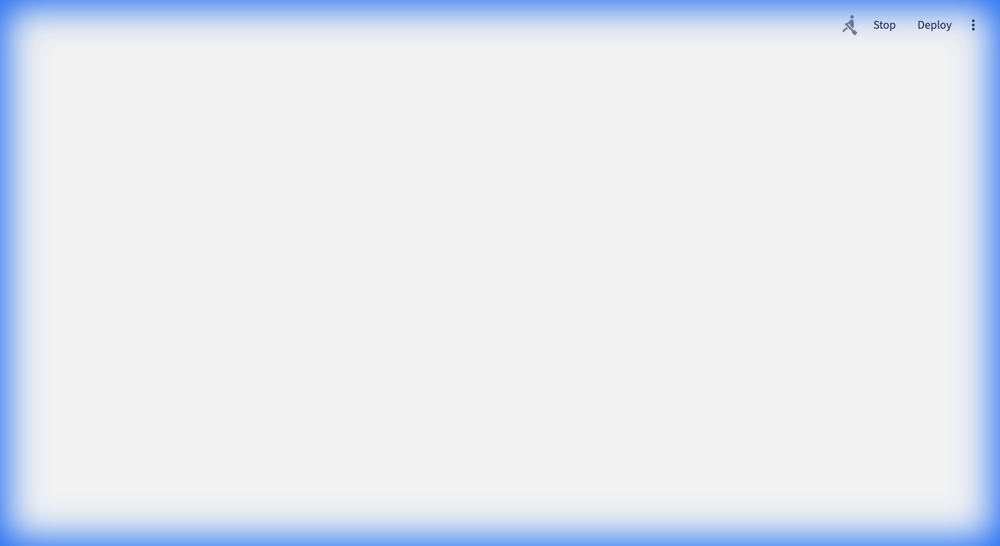
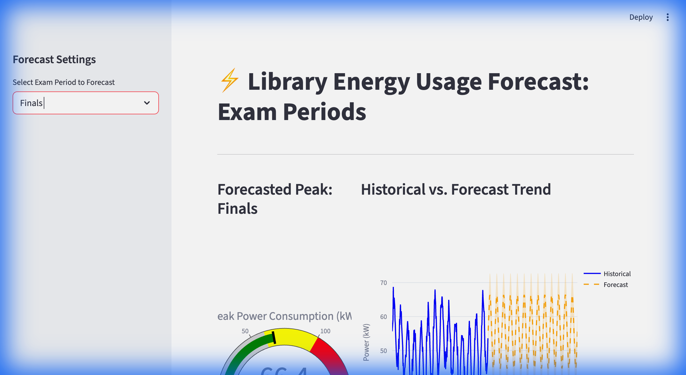

# Library Energy Forecast During Exams ⚡📚

This project aggregates historical library energy usage with academic calendars to implement exponential smoothing forecasts for semester-end energy surges.

## Features
- **Data Aggregation**: Merges synthetic hourly energy logs with an academic event calendar (Midterms, Finals).
- **Forecasting Engine**: Uses Holt-Winters Exponential Smoothing to predict energy peaks during high-stress periods.
- **Interactive Dashboard**: A Streamlit-based dashboard featuring:
  - **Gauge Chart**: Visualizes forecasted peak power consumption (kW).
  - **Trend Analysis**: Compares historical trends with predicted usage and confidence intervals.
  - **Period Selection**: Toggle between different academic events to see specific forecasts.

## Screenshots

### Midterms Forecast


### Finals Forecast


## Installation & Setup

1. **Clone the repository**:
   ```bash
   git clone git@github.com:gaurigulhane/Library-Energy-Forecast-During-Exams.git
   cd Library-Energy-Forecast-During-Exams
   ```

2. **Set up a virtual environment**:
   ```bash
   python3 -m venv .venv
   source .venv/bin/activate
   ```

3. **Install dependencies**:
   ```bash
   pip install pandas numpy statsmodels streamlit plotly matplotlib
   ```

4. **Generate data** (Optional - pre-generated data included):
   ```bash
   python data_generator.py
   ```

5. **Run the dashboard**:
   ```bash
   streamlit run app.py
   ```

## Project Structure
- `app.py`: Streamlit dashboard implementation.
- `forecaster.py`: Holt-Winters forecasting logic.
- `data_generator.py`: Script to generate synthetic energy and calendar data.
- `library_energy.csv`: Historical energy usage logs.
- `academic_calendar.csv`: Academic event dates.
- `screenshots/`: Project visualization images.
