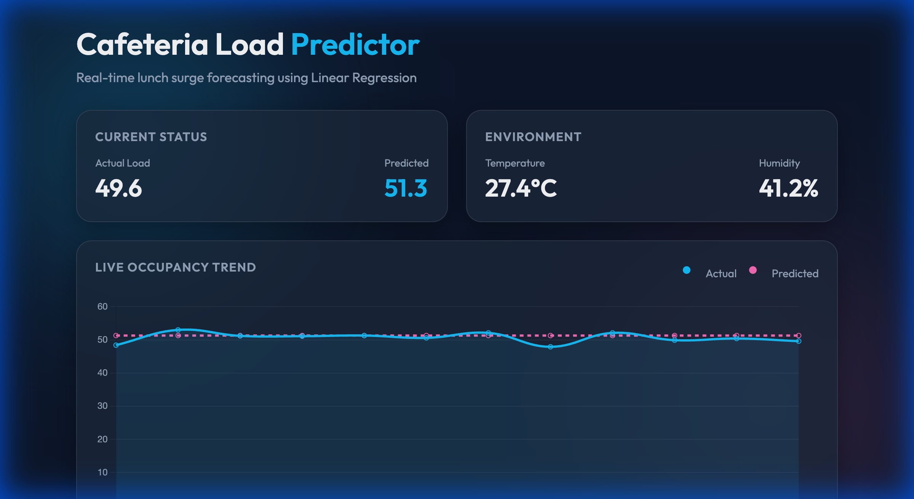

# Cafeteria Load Predictor 🍽️

A real-time dashboard that predicts cafeteria lunch-hour surges using **Linear Regression** and visualizes occupancy trends via **WebSockets**.



## 🚀 Overview

This project aims to optimize cafeteria management by predicting peak occupancy surges based on environmental factors like temperature, humidity, and the time of day. It features a modern, glassmorphism-inspired dashboard that provides live updates and predictive insights.

## ✨ Features

- **Real-time Visualization**: Live line charts showing "Actual vs Predicted" load using Chart.js.
- **Predictive Modeling**: Simple yet effective Linear Regression model trained on synthetic historical data.
- **Live Atmosphere Monitoring**: Simulated real-time temperature and humidity tracking.
- **Dynamic Insights**: Automated surge alerts and flow status messages based on model accuracy.
- **Premium UI**: Responsive Dark Mode design with glassmorphism effects and smooth animations.

## 🛠️ Tech Stack

- **Backend**: FastAPI (Python), WebSockets
- **Machine Learning**: Scikit-Learn (Linear Regression), NumPy, Pandas
- **Frontend**: Vanilla HTML5, CSS3, JavaScript
- **Visualization**: Chart.js
- **DevOps**: Git (Incremental Commit Architecture)

## 📸 Real-time Demo


## 📋 Getting Started

### Prerequisites

- Python 3.8+
- pip

### Installation

1. **Clone the repository**:
   ```bash
   git clone git@github.com:DevDhapodkar/Cafeteria-Load-Prediction-Tasks.git
   cd Cafeteria-Load-Prediction-Tasks
   ```

2. **Install dependencies**:
   ```bash
   pip install fastapi uvicorn scikit-learn numpy pandas joblib
   ```

3. **Train the Model**:
   Generate synthetic data and train the initial Linear Regression model.
   ```bash
   python model_trainer.py
   ```

4. **Run the Dashboard**:
   ```bash
   python main.py
   ```

5. **View the Project**:
   Open your browser and navigate to `http://localhost:8000`.

## 🧠 How it Works

1. **Data Generation**: `model_trainer.py` creates a synthetic dataset mapping temperature, humidity, and time to cafeteria occupancy.
2. **Model Training**: A Linear Regression model is fitted to this data and saved as a `.joblib` file.
3. **Websocket Stream**: The FastAPI server (`main.py`) simulates a live environment, calculating new predictions every 2 seconds.
4. **Live UI**: The frontend connects via WebSockets to receive these updates and render them instantly on the dashboard.

---
Developed as part of the **Hack-o-week** project.
