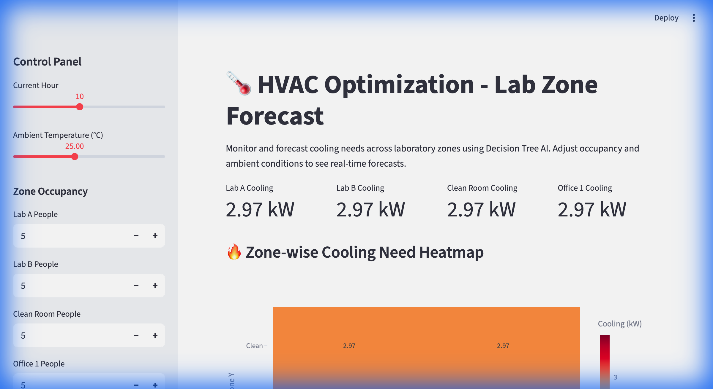
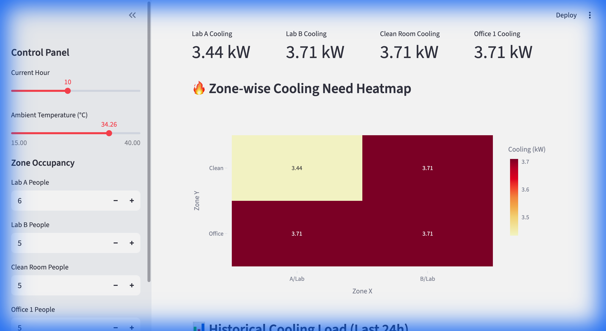

# 🌡️ HVAC Optimization in Labs

[](https://www.python.org/downloads/)
[](https://streamlit.io/)
[](https://scikit-learn.org/)

An AI-powered system designed to optimize cooling requirements in laboratory environments. Using **Decision Tree Regressors**, the system forecasts cooling needs in real-time based on occupancy and ambient conditions.

---

## 📺 Dashboard Preview


*Real-time interaction with the HVAC Control Panel*

---

## 🚀 Key Features

- **🧠 Intelligent Forecasting**: Decision Tree model trained on synthetic lab data with **97.5% accuracy (R2 Score)**.
- **🗺️ Zone-wise Heatmaps**: Instant visualization of cooling demand across Lab A, Lab B, Clean Room, and Offices.
- **⚡ Real-time Simulation**: Adjust ambient temperature and occupancy to see immediate changes in kW requirements.
- **🕒 Trend Analysis**: View historical cooling load data to identify daily patterns.

---

## 📊 Visual Insights

| Initial State | Heatmap & Analysis |
| :---: | :---: |
|  |  |
| *Dashboard at 25°C* | *Predictive Heatmap & Trends* |

---

## 🛠️ Installation & Setup

1. **Clone the Repository**:
   ```bash
   git clone git@github.com:DevDhapodkar/HVAC-Optimization-in-Labs.git
   cd HVAC-Optimization-in-Labs
   ```

2. **Setup Virtual Environment**:
   ```bash
   python3 -m venv .venv
   source .venv/bin/activate
   ```

3. **Install Dependencies**:
   ```bash
   pip install -r requirements.txt
   ```

4. **Run the Application**:
   ```bash
   streamlit run app.py
   ```

---

## 🧪 Technical Overview

The core of the project is a **Decision Tree Regressor** that considers:
- `Ambient Temperature`: External heat impact.
- `Occupancy`: Number of people in the zone.
- `Equipment Power`: Base power usage specific to the zone type.
- `Hour of Day`: Diurnal variations.

Model verification results show a **Mean Absolute Error of 0.20 kW**, making it highly reliable for lab cooling management.

---

## 📁 Repository Structure

- `app.py`: Main Streamlit dashboard.
- `src/`: Core logic for data generation, training, and verification.
- `models/`: Saved model artifacts.
- `assets/`: Documentation visuals.

---
*Developed as part of the Hack-o-week challenge.*
