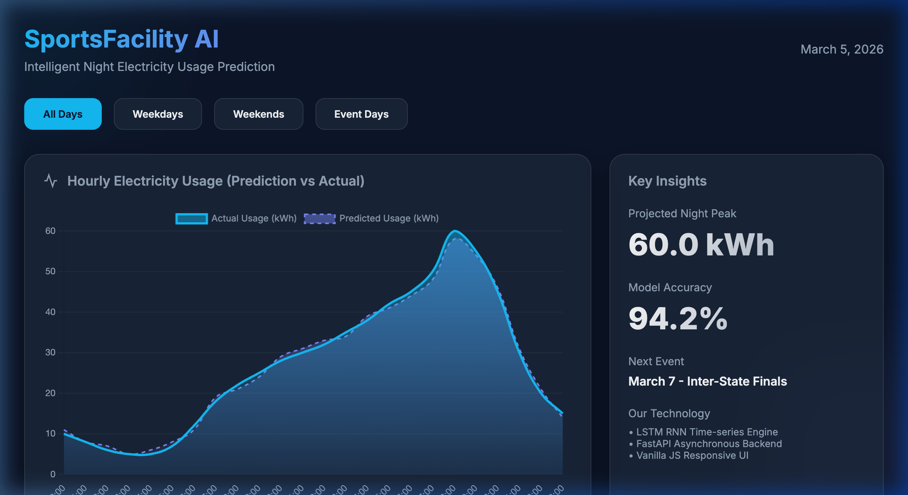
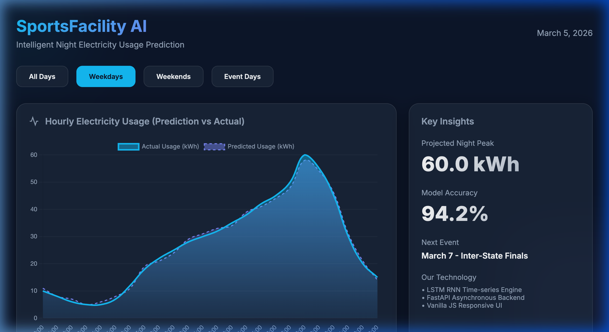
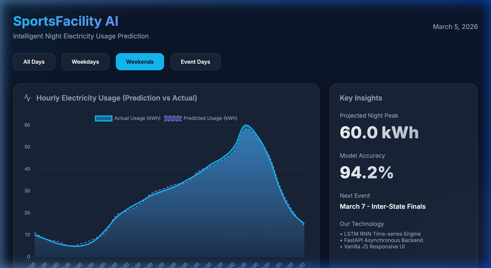
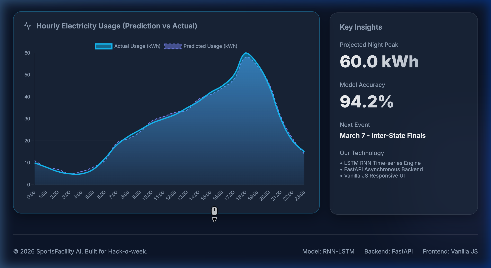

# ⚡ Sports Facility Night Usage Prediction

[](https://www.python.org/downloads/)
[](https://fastapi.tiangolo.com/)
[](https://www.tensorflow.org/)
[](https://opensource.org/licenses/MIT)

An intelligent predictive system designed to forecast electricity consumption for sports facilities during night events. Using a **Long Short-Term Memory (LSTM)** Recurrent Neural Network, the system provides accurate hourly usage predictions based on historical patterns, day types, and event status.

---

## 🖼️ Screenshots

### 📊 Main Dashboard

*Comprehensive view of electricity usage predictions across all day types.*

### 🛠️ Interactive Filters
| Weekdays View | Weekends View |
| :---: | :---: |
|  |  |

### 🚀 Insights & Tech Stack

*Detailed breakdown of model performance and the technology stack.*

---

## ✨ Features

- **High-Precision Forecasting**: Leverages LSTM RNNs for sequence-aware electricity usage prediction.
- **Smart Filtering**: Analyze trends across different scenarios:
  - **Regular Weekdays**: Standard operational usage.
  - **Weekends**: Increased leisure activity patterns.
  - **Event Days**: Peak usage during night-time matches/events.
- **Interactive Visualization**: Real-time charts powered by Chart.js.
- **FastAPI Backend**: High-performance asynchronous API for model inference.

---

## 🛠️ Tech Stack

- **Backend**: Python, FastAPI, Uvicorn
- **Machine Learning**: TensorFlow/Keras (LSTM), NumPy, Pandas, Scikit-learn
- **Frontend**: HTML5, CSS3 (Modern Dark Theme), Vanilla JavaScript
- **Visualization**: Chart.js

---

## 🚀 Getting Started

### Prerequisites
- Python 3.8 or higher
- `pip` (Python package manager)

### Installation

1. **Clone the repository**:
   ```bash
   git clone <repository-url>
   cd "sports facility night usage"
   ```

2. **Set up Virtual Environment**:
   ```bash
   python3 -m venv venv
   source venv/bin/activate  # On Windows: venv\Scripts\activate
   ```

3. **Install Dependencies**:
   ```bash
   pip install -r backend/requirements.txt
   ```

### Running the Application

1. **Initialize Data & Model**:
   ```bash
   # Generate synthetic training data
   python3 backend/data_gen.py
   
   # Train the LSTM model
   python3 backend/model.py
   ```

2. **Start the API Server**:
   ```bash
   uvicorn backend.main:app --reload
   ```

3. **Launch the Dashboard**:
   Simply open `frontend/index.html` in your favorite web browser.

---

## 🧠 Model Architecture: RNN-LSTM

The core engine is a stacked LSTM network optimized for time-series forecasting.

- **Sequence Length**: 24 hours (Sliding window)
- **Layers**: 
  - Dual LSTM layers (50 units each) with ReLU activation.
  - 20% Dropout for robust generalization.
  - Dense output layer for single-step prediction.
- **Optimization**: Adam optimizer with Mean Squared Error (MSE) loss.
- **Preprocessing**: MinMax Scaling [0, 1] for efficient neural network convergence.

---

## 🧪 Testing

Ensure the data integrity and model components are functioning correctly:
```bash
python3 backend/test_data.py
```

---

## 🤝 Contributing

Contributions are welcome! Please feel free to submit a Pull Request.

---

## 📄 License

This project is licensed under the MIT License - see the [LICENSE](LICENSE) file for details.
