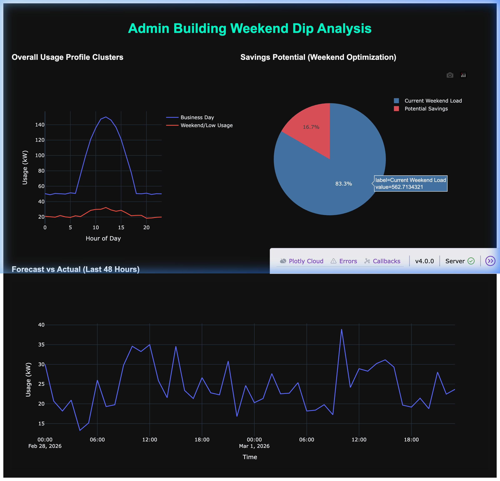

# Admin Building Weekend Dip Analysis

This project analyzes energy consumption patterns in an administration building to identify and optimize "weekend dips." It uses K-Means clustering to automatically categorize days into usage profiles and regression to forecast needs.

## 📊 Features
- **Profile Clustering**: Uses K-Means to separate standard working days from weekends/holidays based on hourly consumption shapes.
- **Consumption Forecasting**: Linear regression models tailored to specific day-types.
- **Optimization Insights**: Visualization of potential savings through weekend load reduction.

## 🛠️ Tech Stack
- **Analysis**: Scikit-Learn (K-Means), Pandas, NumPy
- **Dashboard**: Plotly Dash
- **Persistence**: Joblib for model serialization

## 🖥️ Usage
1. Install dependencies:
   ```bash
   pip install -r requirements.txt
   ```
2. Run the dashboard:
   ```bash
   python app.py
   ```
   *The script will automatically generate synthetic data and train models on the first run.*

## 📈 Dashboard Preview

