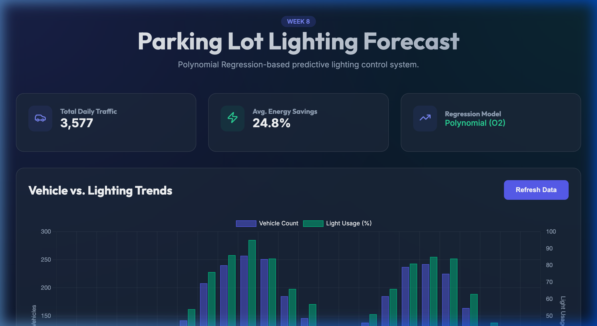

# Week 8: Parking Lot Lighting Forecast

A predictive lighting control system for parking lots that uses **Polynomial Regression (Degree 2)** to forecast energy needs based on vehicle traffic.

## Project Overview
This repository implements a sensor-driven dashboard that helps optimize campus energy usage by adjusting lighting intensity dynamically. It uses historical and real-time vehicle count data to build a regression model that predicts the "ideal" light usage.

### Key Features
- **Predictive Modeling**: Uses polynomial regression (Order 2) to map vehicle counts to light usage.
- **Real-Time Visualization**: Interactive bar charts (using `chart.js`) showing the delta between traffic and lighting.
- **Anomaly Detection**: Alerts the user if light usage is significantly higher than the regression model's prediction, indicating potential energy waste or sensor error.
- **Glassmorphic UI**: High-fidelity dark mode design for a premium dashboard experience.

## Dashboard Preview

## Tech Stack
- React
- Vite
- Chart.js
- Regression.js
- Lucide React (Icons)

## Getting Started
1. `npm install`
2. `npm run dev`
