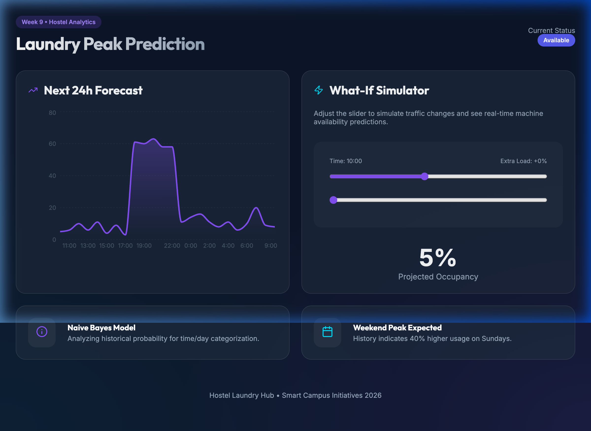

# Week 9: Hostel Laundry Peak Prediction

An intelligent analytical dashboard designed to predict peak hours for hostel laundry facilities using a **Naive Bayes Classifier**.

## Project Overview
This tool helps students avoid long wait times and optimizes machine usage by predicting facility occupancy. It categorizes time slots into "Busy", "Normal", or "Quiet" based on historical time-of-day and day-of-week probabilities.

### Key Features
- **Usage Categorization**: Uses a Naive Bayes model to determine most likely occupancy states.
- **24-Hour Forecast**: Interactive area chart showing the predicted usage trend for the next day.
- **What-If Simulator**: Allows users to simulate traffic spikes or different time slots to see how occupancy might shift.
- **Premium Analytics**: Built with Recharts for smooth, high-fidelity data visualization.

## Dashboard Preview

## Tech Stack
- React
- Vite
- Recharts
- Date-fns
- Lucide React

## Getting Started
1. `npm install`
2. `npm run dev`
